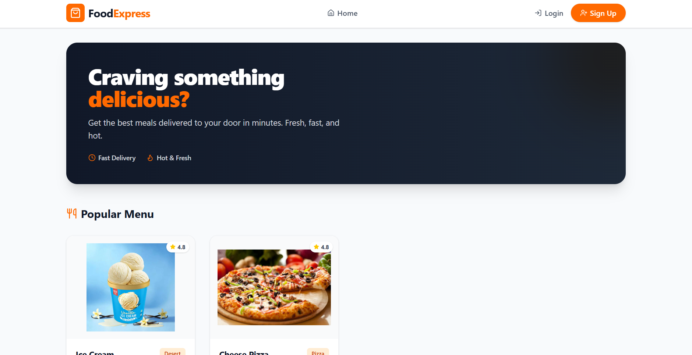
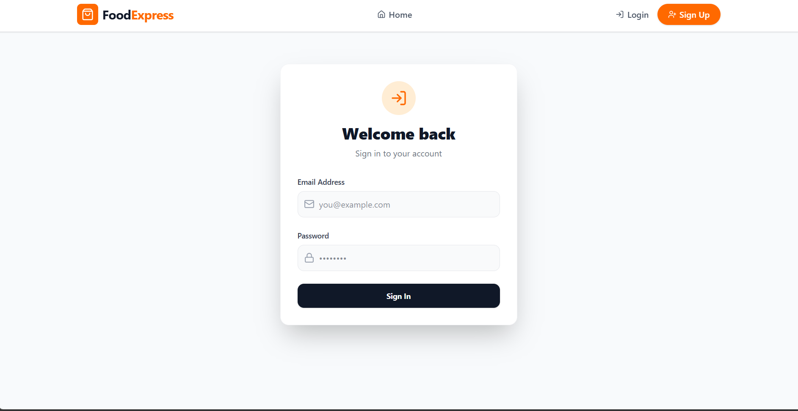
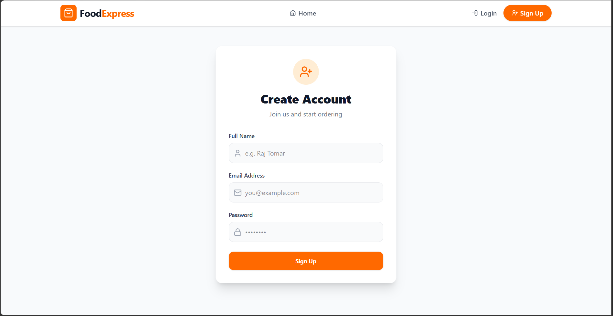
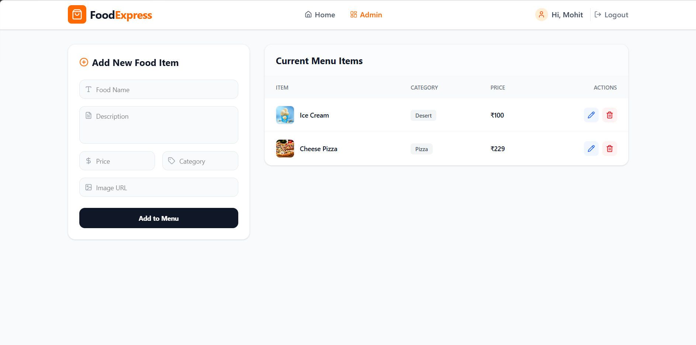

# 🍔 FoodExpress

> A modern, full-stack food delivery platform built with the MERN Stack featuring secure authentication, real-time menu management, and a responsive customer experience.


---

## 📖 Overview

FoodExpress is a full-stack food delivery web application designed to provide a seamless online food ordering experience. The platform enables customers to browse menus, explore food items, and securely authenticate, while administrators can efficiently manage menu items through a dedicated dashboard.

The application follows modern web development practices using the **MERN Stack**, ensuring scalability, maintainability, and responsive performance across devices.

---

# ✨ Key Features

### 👥 Customer Features

- Secure User Registration & Login
- JWT-based Authentication
- Password Encryption using bcrypt
- Browse Available Food Items
- Responsive Product Grid
- Dynamic Navigation
- Protected Routes
- Modern Responsive UI
- Fast Client-side Routing

### 🔐 Admin Features

- Protected Admin Dashboard
- Add New Food Items
- Edit Existing Items
- Delete Menu Items
- Real-time Menu Management
- Database Integration

### ⚙️ Backend Features

- RESTful API Architecture
- MongoDB Atlas Integration
- Express.js Server
- Mongoose ODM
- Environment Variable Configuration
- Authentication Middleware
- Error Handling
- Secure API Endpoints

---

# 🛠 Tech Stack

## Frontend

- React.js (Vite)
- Tailwind CSS
- React Router DOM
- Axios
- Lucide React

## Backend

- Node.js
- Express.js
- MongoDB Atlas
- Mongoose
- JSON Web Token (JWT)
- bcryptjs
- dotenv
- CORS

---

# 📂 Project Structure

```
FoodExpress/
│
├── backend/
│   ├── models/
│   ├── routes/
│   ├── .env
│   ├── server.js
│   └── package.json
│
├── frontend/
│   ├── public/
│   ├── src/
│   │   ├── assets/
│   │   ├── components/
│   │   ├── pages/
│   │   │   ├── Home.jsx
│   │   │   ├── Login.jsx
│   │   │   ├── Register.jsx
│   │   │   └── AdminDashboard.jsx
│   │   ├── App.jsx
│   │   ├── index.css
│   │   └── main.jsx
│   ├── index.html
│   ├── package.json
│   └── vite.config.js
│
└── README.md
```

---

# 🚀 Installation

## 1. Clone the Repository

```bash
git clone https://github.com/MohitPal2005/Food-Delivery-App.git

cd Food-Delivery-App
```

---

## 2. Backend Setup

Navigate to the backend folder

```bash
cd backend
```

Install dependencies

```bash
npm install
```

Create a `.env` file

```env
PORT=5000

MONGO_URI=your_mongodb_connection_string

JWT_SECRET=your_secret_key
```

Run the backend server

```bash
npm run dev
```

Backend will start on

```
http://localhost:5000
```

---

## 3. Frontend Setup

Open another terminal

```bash
cd frontend
```

Install dependencies

```bash
npm install
```

Start the frontend

```bash
npm run dev
```

Frontend will run on

```
http://localhost:5173
```

---

# 🔒 Authentication Flow

```
User Registration
        │
        ▼
Password Encrypted (bcrypt)
        │
        ▼
Stored in MongoDB
        │
        ▼
User Login
        │
        ▼
JWT Token Generated
        │
        ▼
Protected Routes Access
```

---

# 📡 REST API Overview

## Authentication

| Method | Endpoint | Description |
|---------|----------|-------------|
| POST | `/api/auth/register` | Register User |
| POST | `/api/auth/login` | Login User |

---

## Menu

| Method | Endpoint | Description |
|---------|----------|-------------|
| GET | `/api/menu` | Fetch All Food Items |
| POST | `/api/menu` | Add Food Item |
| PUT | `/api/menu/:id` | Update Food Item |
| DELETE | `/api/menu/:id` | Delete Food Item |

> Update the API routes if your project uses different endpoint names.

---

# 💻 Screenshots

### 📸 Home Page


### 📸 Login Page


### 📸 Register Page


### 📸 Admin Dashboard


---

# 🎯 Future Enhancements

- Shopping Cart
- Online Payments (Stripe/Razorpay)
- Order Tracking
- Wishlist
- User Profile
- Order History
- Search & Filters
- Food Categories
- Reviews & Ratings
- Email Notifications
- Admin Analytics Dashboard
- Docker Deployment
- CI/CD Pipeline

---

# ⚡ Performance Highlights

- Responsive Design
- Secure Authentication
- RESTful API
- Optimized React Components
- Reusable Component Architecture
- Clean Folder Structure
- MongoDB Cloud Database
- Fast Development with Vite

---

# 🤝 Contributing

Contributions are always welcome.

1. Fork the repository

2. Create a feature branch

```bash
git checkout -b feature/YourFeature
```

3. Commit your changes

```bash
git commit -m "Add new feature"
```

4. Push to GitHub

```bash
git push origin feature/YourFeature
```

5. Open a Pull Request

---

# 📝 License

This project is licensed under the MIT License.

---

# 👨‍💻 Developer

**Mohit Pal**

B.Tech Computer Science Engineering  
VIT Bhopal University

---

## ⭐ Support

If you found this project helpful, consider giving it a **⭐ Star** on GitHub.

It helps others discover the project and motivates further development.